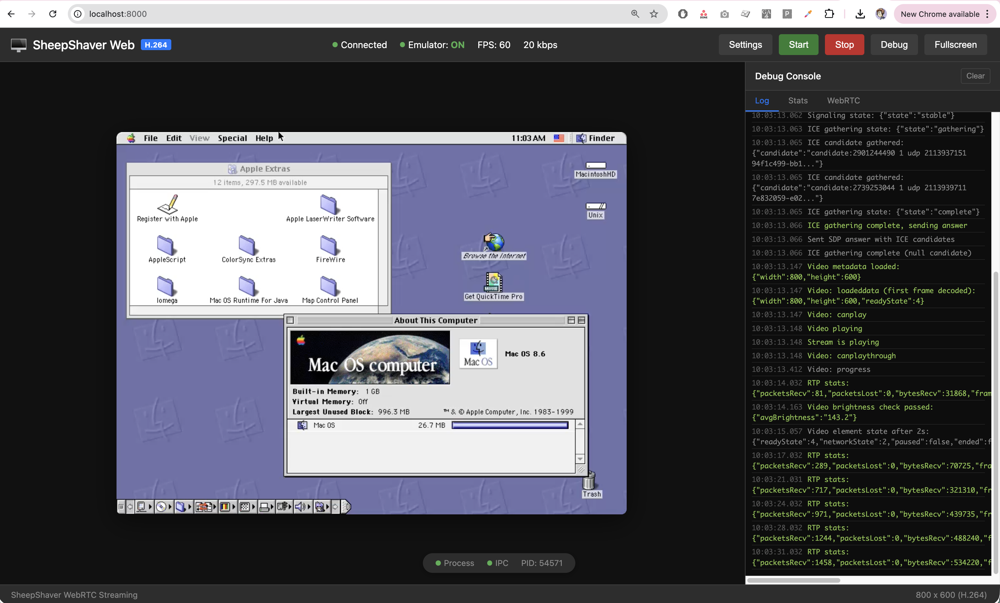

# Running Mac OS 8.6 on Apple Silicon (M1/M2/M3) with Web Streaming

This tutorial walks you through running classic Mac OS 8.6 on an Apple Silicon Mac using SheepShaver with WebRTC-based video streaming. You'll be able to control the emulator from your web browser.



## Prerequisites

- macOS on Apple Silicon (M1, M2, M3, etc.)
- Homebrew installed ([https://brew.sh](https://brew.sh))
- ~1GB of free disk space

## Step 1: Install Dependencies

Open Terminal and install the required packages:

```bash
brew install sdl2 p7zip cmake pkg-config openh264 openssl
```

## Step 2: Clone the Repository

```bash
git clone https://github.com/kanjitalk755/macemu.git
cd macemu
git submodule update --init --recursive
```

## Step 3: Build SheepShaver with IPC Video Support

```bash
cd SheepShaver/src/Unix
NO_CONFIGURE=1 ./autogen.sh
./configure --enable-ipc-video
make -j$(sysctl -n hw.ncpu)
```

This builds SheepShaver with shared memory video output, which allows the web streaming server to capture the screen.

## Step 4: Build the Web Streaming Server

```bash
cd ../../../web-streaming
make deps
make all
```

This builds:
- **libdatachannel** - WebRTC library for browser communication
- **macemu-webrtc** - The streaming server that captures video and handles input

## Step 5: Download Mac OS ROM and Disk Image

Download the SheepShaver ready-to-go package from:

**[SheepShaver Ready-to-Go Package (Mac OS 8.6)](https://www.macintoshrepository.org/51085-sheepshaver-ready-to-go-package-updated-14-05-2021-windows-version)**

Click the download link and save the `.7z` file.

Extract the archive:

```bash
cd ~/Downloads
7z x "SheepShaver-ready-to-go-package--Updated-14-05.2021--windows-version.7z"
```

This gives you:
- `Mac OS ROM` - The PowerPC ROM file required by SheepShaver
- `HDD` - A 500MB disk image with Mac OS 8.6 pre-installed

## Step 6: Set Up Your Working Directory

Create a directory for running the emulator:

```bash
mkdir -p ~/sheepshaver
cd ~/sheepshaver

# Copy the ROM and disk image
cp ~/Downloads/"SheepShaver ready to go package (Updated 14.05.2021) Windows version/Mac OS ROM" .
cp ~/Downloads/"SheepShaver ready to go package (Updated 14.05.2021) Windows version/HDD" .
```

Create a preferences file:

```bash
cat > sheepshaver.prefs << 'EOF'
rom Mac OS ROM
disk HDD
ramsize 134217728
frameskip 0
modelid 14
cpu 4
fpu true
nocdrom true
nosound true
nogui true
screen win/800/600
EOF
```

Configuration notes:
- `ramsize 134217728` = 128MB RAM
- `modelid 14` = Power Mac 9500 (recommended)
- `screen win/800/600` = 800x600 resolution

## Step 7: Run the Streaming Server

In one terminal, start the web streaming server:

```bash
cd /path/to/macemu/web-streaming
./build/macemu-webrtc
```

The server will print something like:
```
WebRTC streaming server started
Control socket: /tmp/macemu-12345.sock
HTTP server: http://localhost:8000
```

Note the socket path (e.g., `/tmp/macemu-12345.sock`).

## Step 8: Run SheepShaver

In another terminal, run SheepShaver with the socket path:

```bash
cd ~/sheepshaver
MACEMU_CONTROL_SOCK=/tmp/macemu-12345.sock /path/to/macemu/SheepShaver/src/Unix/SheepShaver --config sheepshaver.prefs
```

Replace `/tmp/macemu-12345.sock` with the actual socket path from Step 7.

## Step 9: Connect from Your Browser

Open your web browser and navigate to:

```
http://localhost:8000
```

You should see the Mac OS 8.6 desktop. Click anywhere on the screen to capture your mouse (pointer lock). Press **Escape** to release the mouse.

## Troubleshooting

### "ROM file not found"
Make sure the `Mac OS ROM` file is in the same directory as your prefs file, and the path in the prefs file matches exactly.

### Black screen in browser
1. Check that SheepShaver is running (you should see it in Activity Monitor)
2. Try refreshing the browser page
3. Check the terminal for error messages

### Mouse not working
1. Click on the video to enable pointer lock
2. Make sure you're using a modern browser (Chrome, Firefox, Safari)

### Emulator crashes immediately
Try reducing RAM: change `ramsize 134217728` to `ramsize 67108864` (64MB).

## Tips

- **Codec Selection**: The web UI (gear icon) lets you choose between H.264 (better compression) and PNG (lossless, higher bandwidth)
- **Full Screen**: Press F11 in your browser for full-screen mode
- **Multiple Monitors**: You can open the URL on any device on your local network

## File Locations Summary

After following this tutorial, your files should be organized as:

```
~/sheepshaver/
├── Mac OS ROM          # PowerPC ROM
├── HDD                 # Mac OS 8.6 disk image
└── sheepshaver.prefs   # Configuration file

/path/to/macemu/
├── SheepShaver/src/Unix/
│   └── SheepShaver     # The emulator binary
└── web-streaming/
    └── build/
        └── macemu-webrtc  # The streaming server
```

## Credits

- [SheepShaver](https://sheepshaver.cebix.net/) - The PowerPC emulator
- [macemu](https://github.com/kanjitalk755/macemu) - Modern maintained fork
- ROM and disk image from [Macintosh Repository](https://www.macintoshrepository.org/)
